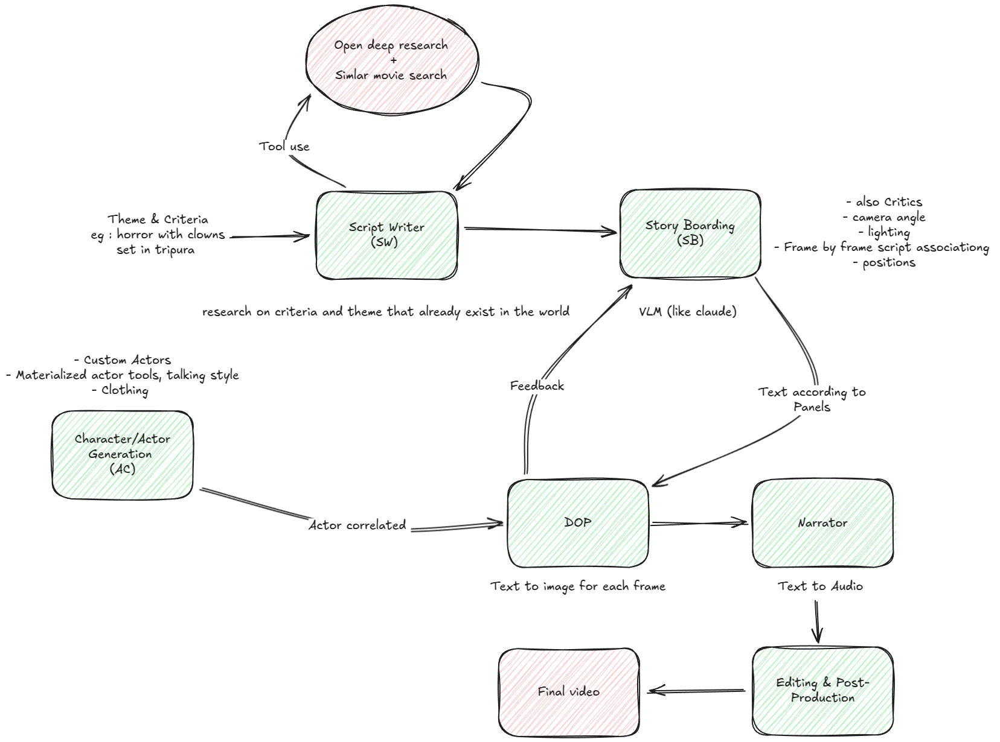

# Hitchcock - AI-Powered Movie Production Pipeline

Hitchcock is an innovative multi-agent system that automates the movie production pipeline from script to screen. Built with modern AI technologies, it orchestrates specialized agents to handle different aspects of movie production, from scriptwriting to visual implementation.

## 🎯 Key Features

- **Automated Script Generation**: AI-powered script creation with deep research capabilities
- **Intelligent Story Boarding**: Automated scene breakdown and shot planning
- **Visual Element Planning**: Comprehensive planning of lighting, props, and atmosphere
- **Multi-Agent Architecture**: Specialized agents working together in a coordinated pipeline
- **Modern Tech Stack**: Built with Python 3.8+, using cutting-edge AI and media processing libraries

## 🏗 System Architecture



The system consists of the following specialized agents:

### 1. Script Writer Agent
- **Purpose**: Creates and analyzes movie scripts
- **Capabilities**:
  - Deep web research for historical/cultural context
  - Similar movie analysis for inspiration
  - Scene and dialogue generation
  - Script structure analysis
- **Tools**:
  - Web browsing and research tools
  - Text analysis and inspection
  - Scene generation and analysis

### 2. Story Boarding Agent
- **Purpose**: Converts scripts into detailed visual plans
- **Capabilities**:
  - Scene importance analysis
  - Shot sequence planning
  - Visual element specification
  - Camera angle and movement planning
- **Features**:
  - Automatic scene breakdown
  - Shot-by-shot planning
  - Lighting and atmosphere specification
  - Prop and special effect planning

### 3. Director of Photography (DOP) Agent
- **Purpose**: Handles visual implementation of story boards
- **Status**: In development
- **Planned Features**:
  - Text-to-image generation
  - Scene composition
  - Visual continuity management
  - Lighting implementation

## 🚀 Getting Started

### Prerequisites
- Python 3.8 or higher
- `uv` package manager

### Installation

1. Install uv:
```bash
pip install uv
```

2. Clone the repository:
```bash
git clone https://github.com/yourusername/hitchcock.git
cd hitchcock
```

3. Set up the environment:
```bash
uv venv
source .venv/bin/activate  # On Unix
# or
.venv\Scripts\activate  # On Windows
```

4. Install dependencies:
```bash
uv pip sync requirements.txt
```

### Running the System

1. Configure environment variables:
```bash
cp .env.template .env
# Edit .env with your API keys and configurations
```

2. Start the control plane:
```bash
python control_plane.py
```

## 📁 Project Structure

```
hitchcock/
├── control_plane.py      # Main orchestration system
├── requirements.txt      # Project dependencies
├── .env.template        # Environment variable template
├── agents/
│   ├── script_writer/   # Script Writer Agent
│   │   ├── agent.py     # Agent implementation
│   │   ├── prompt.py    # Agent prompts
│   │   ├── tools.py     # Script writing tools
│   │   └── scripts/     # Additional scripts
│   ├── story_boarder/   # Story Boarding Agent
│   │   ├── prompt.py    # Agent prompts
│   │   ├── storage.py   # State management
│   │   └── tools.py     # Story boarding tools
│   └── dop/            # DOP Agent (in development)
├── assets/             # Project assets
└── downloads/          # Downloaded research materials
```

## 🛠 Development

### Managing Dependencies

Add new dependencies:
```bash
uv pip install package_name
uv pip compile  # Update requirements.txt
```

Update all dependencies:
```bash
uv pip compile --upgrade
uv pip sync
```

Test with minimum versions:
```bash
uv pip compile --resolution=lowest
uv pip sync
```


---
*Note: This is an active development project. Features and capabilities may change as development progresses.*
# Hitchcock: AI-Driven Video Generation Pipeline

Hitchcock is a sophisticated multi-agent movie maker that transforms storyboard descriptions into cinematic videos using state-of-the-art AI models.

## Architecture

### Core Components

1. **Storyboard Engine**
   - Processes structured scene descriptions
   - Manages character continuity and visual themes
   - Uses Pydantic for robust data validation

2. **Image Generation Service**
   - Leverages Stable Diffusion XL for high-quality image generation
   - Maintains visual consistency across frames
   - Handles character and environment rendering

3. **Video Processing Pipeline**
   - Converts image sequences to video
   - Implements cinematic camera movements
   - Manages temporal consistency

4. **Asset Management**
   - Stores and retrieves generated assets
   - Handles metadata and relationships
   - Integrates with VideoDB for efficient storage

### Tech Stack

- **Framework**: Modal (Serverless deployment)
- **Image Generation**: HuggingFace Diffusers
- **Video Processing**: MoviePy
- **Data Validation**: Pydantic v2
- **Asset Storage**: VideoDB

## Setup

```bash
# Clone the repository
git clone https://github.com/ayushnangia/Hitchcock.git
cd Hitchcock

# Create virtual environment
python -m venv venv
source venv/bin/activate  # On Windows: .\venv\Scripts\activate

# Install dependencies
pip install -r requirements.txt
```

## Project Structure

```
├── hitchcock/
│   ├── core/
│   │   ├── models.py      # Pydantic models
│   │   └── config.py      # Configuration management
│   ├── services/
│   │   ├── image.py       # Image generation service
│   │   ├── video.py       # Video processing service
│   │   └── storage.py     # Asset management
│   └── utils/
│       ├── validators.py  # Custom validators
│       └── helpers.py     # Utility functions
├── tests/
├── requirements.txt
└── README.md
```

## License

MIT
